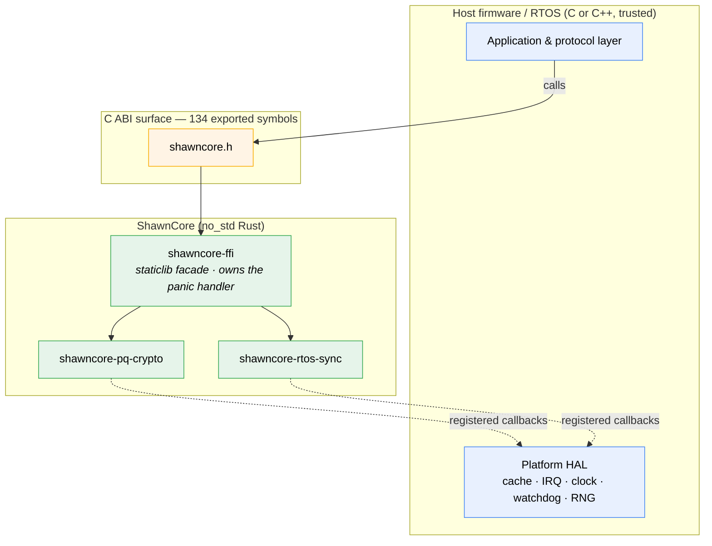
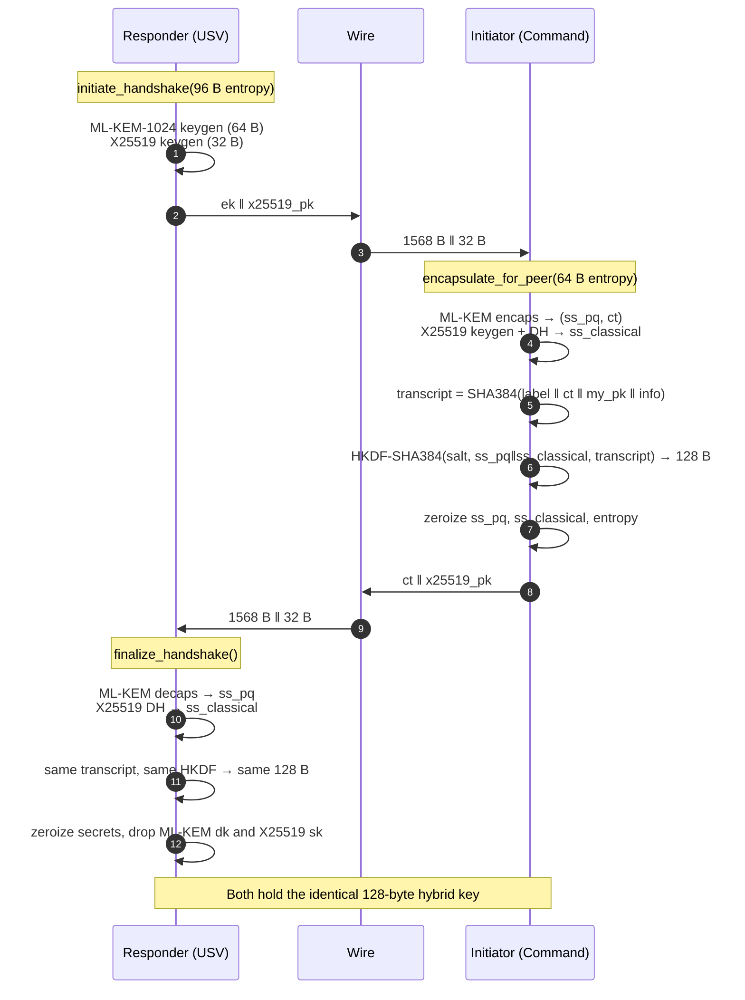
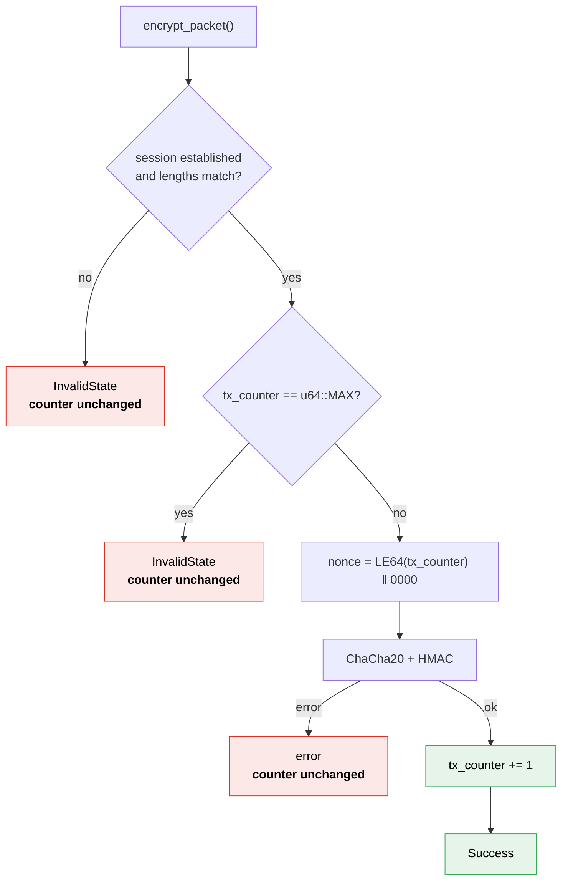
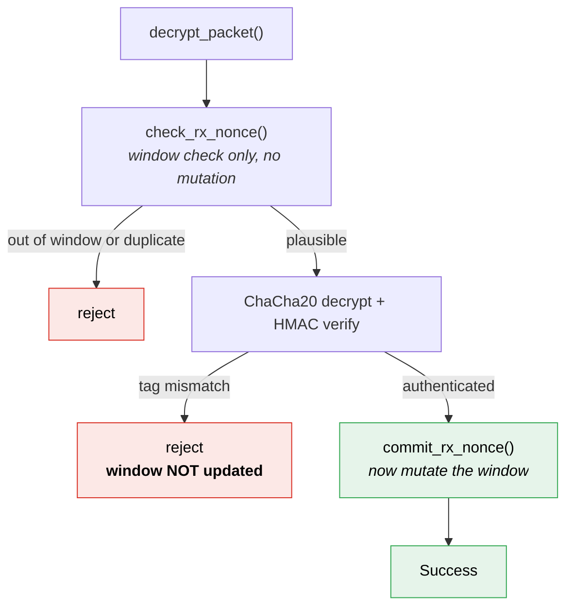
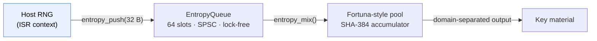
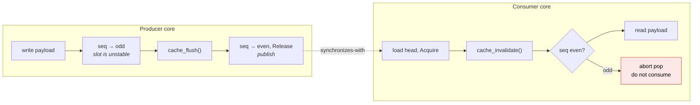
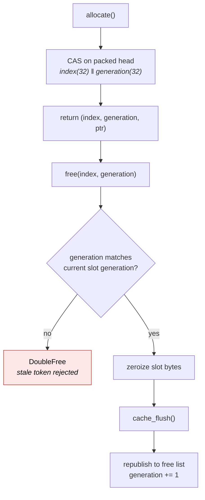
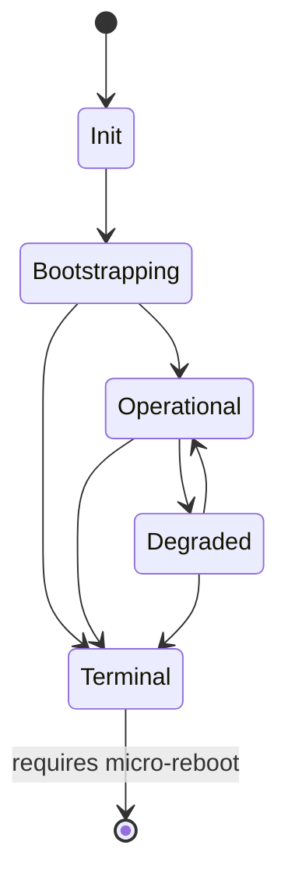
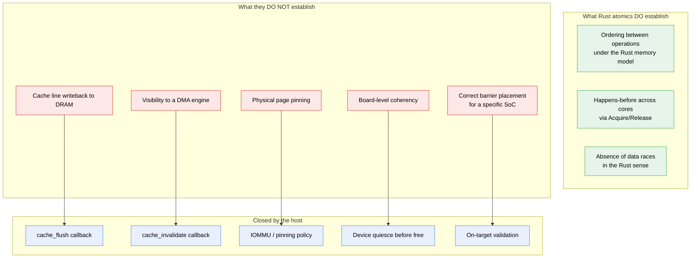
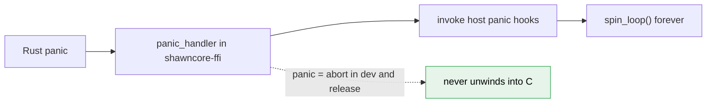

# Architecture

This document explains how ShawnCore is built and, more importantly, **why the
boundaries fall where they do**. Every design decision below was made to keep
platform-specific behavior visible and reviewable rather than buried inside a
library that claims more than it can prove.

Status: release-candidate prototype for technical evaluation. See
[VALIDATION.md](VALIDATION.md) for what has actually been executed and
[SECURITY.md](SECURITY.md) for the threat model.

---

## 1. The Central Design Principle

> **The library owns what it can prove. The host owns what only hardware can settle.**

A cryptography or RTOS library on an embedded target is always tempted to reach
into the platform — flush a cache, mask an interrupt, wipe a stack, read an RNG.
Every one of those reaches is a correctness claim the library cannot verify on a
board it has never seen.

ShawnCore inverts that. Anything hardware-dependent is a **registered host
callback** with a documented contract. The result is that the exact set of
assumptions a reviewer must validate on target is finite, enumerated, and
visible at the API surface instead of implied.

Concretely, the library never assumes it can:

| Tempting shortcut | Why it is rejected | What happens instead |
|---|---|---|
| Flush caches with inline asm | Instruction sequence is core- and SoC-specific | Host registers a cache flush/invalidate callback |
| Wipe the caller's stack | Frame layout is ABI- and optimizer-dependent; risks clobbering frame pointers | Every sensitive local calls `.zeroize()` on every return path |
| Read a hardware RNG | Peripheral, health-test policy, and quality are platform decisions | Host pushes entropy into an SPSC queue |
| Perform a context switch | Register set and exception model are architecture-specific | Scheduler returns the next stack pointer; host switches |
| Assume atomics imply DMA visibility | They do not, on any real SoC | Cache callbacks are invoked at ownership transitions |

That last row is the one most libraries get wrong, and it is stated explicitly
throughout this codebase: **Rust atomic ordering establishes ordering under the
Rust memory model. It does not perform cache maintenance and does not prove
device visibility.**

---

## 2. Layering



Solid arrows are calls into ShawnCore. Dotted arrows are the callbacks
ShawnCore makes back into the platform. **The dotted arrows are the complete set
of hardware assumptions in the system.** There are seven of them:

`panic` · `disable_interrupts` · `restore_interrupts` · `cache_flush` ·
`cache_invalidate` · `monotonic_clock` · `pet_watchdog`

### Why three crates

- **`shawncore-pq-crypto`** and **`shawncore-rtos-sync`** are independent. Neither
  depends on the other. A reviewer can evaluate the cryptography without reading
  the scheduler, and an RTOS integrator can use the queues without linking any
  cryptography.
- **`shawncore-ffi`** exists for exactly one reason: a `no_std` static library
  needs exactly one `#[panic_handler]`, and a library crate cannot define one
  without conflicting. The facade owns it, and re-exports both component crates
  so their `#[no_mangle]` symbols are retained in the archive.

---

## 3. The Static Library Is Self-Contained

Measured on the `aarch64-unknown-none` release build:

```text
$ nm -g --undefined-only libshawncore_ffi.a  |  minus everything the archive defines
(empty)
```

**The archive requires zero external symbols.** `memcpy`, `memset`, `memcmp`,
`memmove`, and the AArch64 soft-float builtins are all supplied inside it by
`compiler_builtins`. There is:

- no `malloc`, `calloc`, `realloc`, or `free`
- no `__rust_alloc` — the Rust allocator is never linked
- no libc I/O, no `mmap`, no pthreads, no `errno`

Every object the library operates on is **caller-allocated**. That is why the
ABI exposes `_sizeof()` / `_alignof()` for each opaque type instead of a
constructor that returns a pointer. There is no hidden allocation anywhere in
the call graph, which is what makes the memory footprint statically bounded.

---

## 4. Hybrid Session Establishment

### 4.1 Why hybrid

ML-KEM-1024 is young. X25519 is not quantum-resistant. Combining them means an
attacker must break **both** to recover the session key: the classical secret and
the post-quantum secret are concatenated before a single HKDF-SHA384 extract, so
neither alone is sufficient.

### 4.2 The handshake



Note step ordering: the initiator computes the transcript **before** deriving,
and both sides bind the same four values. A mismatch in any of them produces a
different key and every subsequent packet fails authentication.

### 4.3 The 128-byte split

The KDF emits 128 bytes, which are partitioned into two independent 64-byte
directional keys. This is the detail integrators most often get wrong, so it is
stated identically everywhere in this repository:

```text
hybrid_key[128]
├── [  0.. 32)  ─┐
├── [ 32.. 96)  ─┼─ responder rx  /  initiator tx     (64 B)
└── [ 96..128)  ─┘

responder tx / initiator rx  =  bytes[0..32] ‖ bytes[96..128]   (64 B)

each 64-byte directional key
├── [ 0..32)  ChaCha20 encryption key
└── [32..64)  HMAC-SHA384 authentication key
```

Each direction gets its own encryption **and** its own MAC key. Directions are
never mixed, so a packet cannot be reflected back at its sender and accepted.

### 4.4 Why not a single shared key

A single bidirectional key would require both peers to coordinate a nonce space
to avoid catastrophic reuse. Splitting by direction means each side owns a
private, monotonic counter and reuse is structurally impossible without a bug in
one endpoint alone.

---

## 5. Packet Protection

### 5.1 Encrypt-then-MAC

ChaCha20 for confidentiality, HMAC-SHA384 for authenticity, in that order. The
48-byte tag is verified in constant time via `subtle` **before** any plaintext is
released and before any state is mutated.

### 5.2 Nonce discipline on transmit



Every failure path leaves `tx_counter` untouched. A nonce is consumed only by a
packet that was actually produced, so no failure mode can cause a nonce to be
reused under the same key. Exhaustion is rejected *before* wraparound, not after.

### 5.3 Replay window, and the ordering that matters

The receiver keeps `rx_counter` (highest accepted sequence) and a 64-bit
`rx_window` bitmask of recently seen sequences.



**Authentication strictly precedes state commitment.** This is the property that
matters: an attacker who floods forged packets with high sequence numbers cannot
advance the replay window, because the window is only updated after the HMAC
verifies. A design that committed first would let an unauthenticated attacker
permanently lock out the legitimate peer. There is a regression test named
`session_rejects_tampering_without_committing_replay_state` guarding exactly this.

### 5.4 Key integrity checksum

Both directional keys carry a 32-bit checksum computed at install time.
`verify_key_integrity()` recomputes and compares both with a branchless
`(tx_diff | rx_diff) != 0`. This detects bit-flips from radiation, glitching, or
memory faults. It is a **fault-detection** mechanism, not an authentication
mechanism — it is not a MAC and is not secret-keyed.

---

## 6. Entropy



The producer is the host, typically from an interrupt handler; the consumer is
the crypto stack. The queue is lock-free so an ISR never blocks. Where a lock is
genuinely required, `CryptoSpinlock` **disables interrupts through the host
callback first**, then spins — the ordering that prevents an ISR from deadlocking
against a lock held by the code it preempted.

The pool conditions and domain-separates its output and evolves state after the
host supplies entropy. It **cannot create entropy**. Source quality and health
testing remain a host and hardware responsibility, and starvation surfaces as a
typed error rather than a silently weak key.

---

## 7. RTOS Primitives

### 7.1 SPSC queue: ownership transfer, not locking



Each slot carries a sequence counter that is **odd while the producer is
mutating it and even when stable**. A consumer that observes an odd counter
aborts the pop rather than reading a torn payload. Acquire/Release ordering
carries the payload write across the core boundary under the Rust memory model;
the registered cache callbacks handle the physical-memory side.

Head and tail indices are each padded to their own 64-byte cache line
(`CacheAlignedIndex`), and every slot is 64-byte aligned, so producer and
consumer never contend on the same line. That is a throughput decision, and it is
why `sizeof(fft_slot)` is 128 bytes for a 64-byte payload.

**The SPSC contract is a safety requirement, not advice.** One stable producer,
one stable consumer, for the entire initialized lifetime. The Rust role methods
are `unsafe` precisely because that property cannot be proven from a shared
reference, and there is no runtime enforcement on the C side either.

### 7.2 DMA pool: ABA-tagged Treiber stack



Lock-free, O(1). The free-list head packs a 32-bit index with a 32-bit ABA
generation in a single `AtomicUsize`, which is why the pool statically asserts a
64-bit target. Each slot additionally carries its own 64-bit generation, handed
back to the caller as a free token — so a **stale free from a previous
allocation cycle is rejected rather than corrupting a live buffer**. Freed
storage is zeroized and flushed before republication, so a device never observes
a stale payload in a recycled buffer.

**Known limit, stated plainly:** the 32-bit ABA tag wraps after $2^{32}$
free-list mutations. Deployments must bound operational lifetime between
reinitializations. This is documented rather than hidden because it is exactly
the kind of thing a target integrator needs to size.

### 7.3 Scheduler: O(1) and genuinely constant-time


One 16-bit bitmap, one `trailing_zeros()` instruction. Selection cost does not
depend on how many tasks are ready — it is the same for 1 task and for 16. That
is what makes worst-case latency analyzable.

The scheduler validates priority bounds, stack range arithmetic (including
overflow), stack alignment, and stack size, and writes/verifies a canary at the
stack base on each switch. It returns the next stack pointer; **the host performs
the actual context switch**, because the register set and exception model are
architecture-specific.

Watchdog petting is gated on a critical-task check-in matrix: the watchdog is
only petted once every task in `critical_task_mask` has checked in during the
current window. A hung critical task therefore causes a reset instead of being
masked by a healthy scheduler loop.

### 7.4 Enclave state machine



Lock-free, `compare_exchange_weak` in a retry loop. Transitions not drawn above
are rejected. `Terminal` is absorbing — there is deliberately no edge back out,
so a fault state cannot be silently cleared.

---

## 8. The Cache and DMA Boundary

This is the single most important thing for a target integrator to understand,
so it gets its own section.



Two distinctions this codebase refuses to blur:

1. **Page alignment is not DMA pinning.** The queues and pool require 4096-byte
   alignment. That is a storage and alignment requirement. It says nothing about
   whether the page is physically resident, pinned, or reachable by a device.
2. **An atomic store is not a cache flush.** The library calls the registered
   cache callbacks at ownership transitions. Whether those callbacks are correct
   for your SoC is a target validation question, and it is listed as an open gate
   in [VALIDATION.md](VALIDATION.md).

---

## 9. FFI Design

### 9.1 Uniform contract

Every entry point follows the same rules, which makes the surface auditable:

- Returns a typed status enum. Nothing signals errors out-of-band.
- Null pointer → `INVALID_STATE`. Bad length or overlap → `INVALID_LENGTH`.
- A pointer paired with a zero length may be null; every other data pointer must
  be non-null, aligned, and valid for the whole call.
- Output objects are validated for overlap against inputs **before** any write,
  so a rejected call never partially clobbers caller memory.
- `#[forbid(unsafe_op_in_unsafe_fn)]` is set crate-wide: every raw-pointer
  dereference sits in an explicit, individually justified `unsafe` block.

### 9.2 Caller-allocated opaque objects

```c
size_t size  = shawncore_crypto_session_manager_sizeof();
size_t align = shawncore_crypto_session_manager_alignof();
/* host allocates; library never does */
```

Measured layouts on the reference build:

| Object | Size (B) | Align (B) |
|---|---:|---:|
| `session_manager` | 4,608 | 64 |
| `ml_kem_publickey` | 2,112 | 64 |
| `ml_kem_decapskey` | 4,224 | 64 |
| `ml_kem_ciphertext` | 1,600 | 64 |
| `ml_dsa_publickey` | 73,856 | 64 |
| `ml_dsa_signingkey` | 104,640 | 64 |
| `ml_dsa_signature` | 4,672 | 64 |
| `x25519_publickey` / `secret` / `sharedsecret` | 64 | 64 |
| `scheduler` | 1,088 | 64 |
| `dmapool2k` | 4,416 | 64 |
| `spsc_fft` / `spsc_telemetry` / `ringbuffer_ew` | 256 | 64 |
| `tcb` / `state_machine` / `latency_tracker` / `fft_result` | 64 | 64 |

**Read the ML-DSA rows carefully.** They are not the FIPS 204 wire sizes; they
are the dependency's *expanded* in-memory representations, which cache
precomputed matrices to make signing and verification fast. An ML-DSA-87 signing
identity therefore costs roughly **178 KB of RAM**, versus 7.5 KB for the encoded
forms. On a memory-constrained MCU that is a sizing decision that must be made
deliberately, so it is published here rather than discovered during integration.

### 9.3 Wire codecs

Because the in-memory forms are expanded and opaque, every value that crosses a
link has an explicit fixed-length codec:

| Value | In memory | On the wire | Standard |
|---|---:|---:|---|
| ML-KEM-1024 public key | 2,112 B | **1,568 B** | FIPS 203 `ek` |
| ML-KEM-1024 ciphertext | 1,600 B | **1,568 B** | FIPS 203 `c` |
| X25519 public key | 64 B | **32 B** | RFC 7748 |
| ML-DSA-87 verifying key | 73,856 B | **2,592 B** | FIPS 204 `pk` |
| ML-DSA-87 signature | 4,672 B | **4,627 B** | FIPS 204 `sigma` |

```c
uint8_t wire[1568];
shawncore_crypto_ml_kem_publickey_to_bytes(pk, wire, sizeof wire);   /* send   */
shawncore_crypto_ml_kem_publickey_from_bytes(wire, sizeof wire, pk); /* recv   */
```

Length is checked against the codec's own `_encoded_len()`, and buffers are
rejected if they overlap the object. **Secret material is deliberately not
exportable**: decapsulation keys, signing keys, and shared secrets have no
serialization entry point, so private key material cannot leave the enclave
through this ABI at all.

### 9.4 Panic containment



Both profiles set `panic = "abort"`, so a Rust panic cannot unwind through the C
ABI and corrupt a C++ or C stack. The host hook must implement a platform
fail-safe response; the handler does not return.

---

## 10. Concurrency Model Summary

| Component | Model | Enforced by |
|---|---|---|
| SPSC queue, ring buffer, entropy queue | 1 producer, 1 consumer, both stable | `unsafe` in Rust; **caller discipline in C** |
| DMA pool | Lock-free multi-threaded, ABA-tagged | Generation tokens |
| State machine | Lock-free CAS retry | Transition table |
| Scheduler | Single owner per core instance | `&mut self` |
| Crypto spinlock | IRQ-disable then spin | Host IRQ callbacks |
| Callback registries | `AtomicPtr`, `SeqCst` | Registration must not race invocation |

---

## 11. What This Architecture Does Not Settle

Stated here so it is not inferred from silence:

- Target ABI behavior with a real cross toolchain.
- Cache coherency, DMA visibility, and barrier correctness on a real board.
- ISR, NMI, FIQ, and watchdog behavior under fault conditions.
- Hardware entropy quality.
- ML-KEM / ML-DSA known-answer and external interoperability testing.
- Side-channel behavior of the compiled artifact on the target core.
- Peer identity, PKI, trust anchors, and revocation — no identity model is
  defined here.
- Independent security review.

Each of these is tracked as an explicit gate in [VALIDATION.md](VALIDATION.md)
with a `BLOCKED` status and a stated reason. None of them is marked passed.
