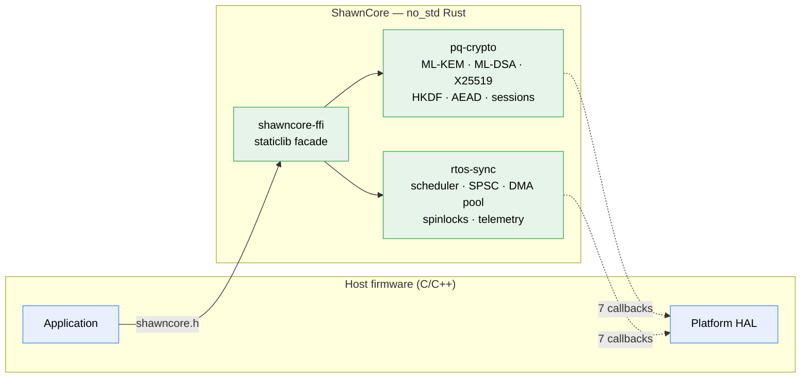

# ShawnCore Libraries

**Hybrid post-quantum session establishment and deterministic RTOS
synchronization for embedded systems, in `no_std` Rust with a C ABI.**

ShawnCore gives firmware two things that are hard to get right and dangerous to
get wrong: a hybrid ML-KEM-1024 + X25519 secure channel, and a set of lock-free
RTOS primitives with analyzable worst-case behavior. It ships as a single
self-contained static library with a C11 header.

> **Status:** release-candidate prototype for external technical evaluation.
> Not certified, not hardware-qualified, not independently reviewed.
> [VALIDATION.md](VALIDATION.md) records exactly what has been executed and what
> has not.

---

## Why this is different

Most embedded crypto libraries quietly reach into the platform — flushing caches
with inline assembly, wiping stacks, reading RNGs, assuming coherency. Each reach
is a correctness claim the library cannot verify on a board it has never seen.

**ShawnCore makes every hardware assumption explicit and finite.** There are
exactly seven, and they are all registered host callbacks:

`panic` · `disable_interrupts` · `restore_interrupts` · `cache_flush` ·
`cache_invalidate` · `monotonic_clock` · `pet_watchdog`

That is the complete list of things a target integrator must validate. Nothing
is hidden inside the library, which is why the open validation gates in this
repository are enumerated rather than implied.

---

## Verified properties

Every claim below is reproducible from a clean checkout with the commands in
[REVIEW.md](REVIEW.md).

| | |
|---|---|
| **Zero external symbols** | The `aarch64-unknown-none` archive resolves entirely within itself. `memcpy`/`memset`/`memcmp` and soft-float builtins are bundled. No libc required. |
| **Zero heap** | No `malloc`, no `__rust_alloc`, no allocator linked. Every object is caller-allocated via published `_sizeof()`/`_alignof()`. |
| **Zero unwinding into C** | `panic = "abort"` in both profiles; the facade owns the single `no_std` panic handler. |
| **134 exported symbols** | Header declarations and archive exports are diffed in CI and must match exactly. |
| **56 tests** | Crypto round trips, tampering, replay, reordering, wire round trips, FFI ownership rejection, entropy callback reentrancy, queue reuse, DMA stale generations, scheduler bounds. |
| **Clean under ASan + Valgrind** | 0 errors, 0 leaks on the C integration binary. |
| **Fuzzed** | `ffi_aead_fuzz` with an 87-input regression corpus; CI runs 10,000 executions. |
| **Bare-metal clean** | `cargo check --target aarch64-unknown-none` with `clippy -D warnings`. |

---

## Architecture at a glance



**[Read ARCHITECTURE.md](ARCHITECTURE.md)** for the design rationale, handshake
sequence, replay-window ordering, DMA/cache boundary, and measured footprint.

---

## Quickstart

```bash
cargo build -p shawncore-ffi --release   # produces target/release/libshawncore_ffi.a
make -C integration run                  # builds and runs the C integration binary
```

Link the archive and include [`shawncore-ffi/include/shawncore.h`](shawncore-ffi/include/shawncore.h).

```c
#include "shawncore.h"

/* 1. Register the platform callbacks this code path needs. */
shawncore_crypto_register_cache_flush(host_cache_flush);
shawncore_crypto_register_panic_hook(host_panic);

/* 2. Allocate the session object yourself — the library never allocates. */
static _Alignas(64) uint8_t storage[8192];
shawncore_crypto_session_manager *s = (void *)storage;
assert(shawncore_crypto_session_manager_sizeof() <= sizeof storage);
shawncore_crypto_session_manager_init(s);

/* 3. Publish your hybrid public keys, in wire format. */
shawncore_crypto_session_manager_initiate_handshake(s, entropy96, pk, xpk);

uint8_t ek_wire[1568], x_wire[32];
shawncore_crypto_ml_kem_publickey_to_bytes(pk,  ek_wire, sizeof ek_wire);
shawncore_crypto_x25519_publickey_to_bytes(xpk, x_wire,  sizeof x_wire);
link_send(ek_wire, sizeof ek_wire);
link_send(x_wire,  sizeof x_wire);

/* 4. Rebuild the peer's values from received bytes and finalize. */
shawncore_crypto_ml_kem_ciphertext_from_bytes(ct_wire, 1568, ct);
shawncore_crypto_x25519_publickey_from_bytes(peer_wire, 32, peer);
shawncore_crypto_session_manager_finalize_handshake(s, peer, ct, NULL, 0, NULL, 0);

/* 5. Send. Nonces are assigned and tracked internally. */
shawncore_crypto_session_manager_encrypt_packet(
    s, aad, aad_len, pt, ct_out, len, out_nonce, out_tag);
```

[`integration/c_api_smoke.c`](integration/c_api_smoke.c) runs this end to end —
two session managers completing a full hybrid handshake with every public value
passed through its wire encoding, then an authenticated packet exchange and a
replay rejection.

---

## Components

| Crate | Contents |
|---|---|
| [`shawncore-pq-crypto`](shawncore-pq-crypto) | ML-KEM-1024, ML-DSA-87, X25519, HKDF-SHA384 hybrid derivation, ChaCha20/HMAC-SHA384 Encrypt-then-MAC, entropy pool and queue, session lifecycle, replay handling, wire codecs |
| [`shawncore-rtos-sync`](shawncore-rtos-sync) | O(1) bitmap scheduler, ABA-tagged DMA pool, SPSC and ring queues, interrupt-aware spinlocks, atomic state machine, latency tracking, telemetry |
| [`shawncore-ffi`](shawncore-ffi) | C-linkable `staticlib` facade; owns the single `no_std` panic handler |

---

## Security model in one paragraph

Session decryption authenticates a packet **before** committing any replay-window
state, so forged traffic cannot poison the window or lock out a legitimate peer.
Failed encryption never advances the transmit sequence, so no failure path can
reuse a nonce. Re-establishment zeroizes prior directional keys and resets
transmit and replay state before installing replacements. Sensitive material is
explicitly zeroized on every return path, success or error. Secret keys have no
serialization entry point and cannot be exported through the ABI.

Full trust boundaries, in-scope and out-of-scope threats, known limitations, and
the host integration contract: **[SECURITY.md](SECURITY.md)**.

---

## Key facts an integrator needs early

**The 128-byte hybrid KDF split.** For a responder, transmit material is bytes
`0..32 ‖ 96..128` and receive material is bytes `32..96`; the initiator uses the
complementary assignment. Each 64-byte directional key is 32 bytes of ChaCha20
key plus 32 bytes of HMAC-SHA384 key.

**ML-DSA-87 is RAM-expensive in this representation.** A verifying key is 73,856
bytes in memory versus 2,592 on the wire; a signing key is 104,640 bytes versus
4,896. The dependency caches expanded matrices for speed. Budget roughly 178 KB
for a signing identity, or use ML-DSA selectively.

**Page alignment is not DMA pinning, and atomics are not cache maintenance.**
The library requires 4096-byte alignment as a storage property and calls your
cache callbacks at ownership transitions. Physical residency, pinning, device
quiesce, and board-level coherency remain yours.

**The SPSC contract is a safety requirement.** One stable producer, one stable
consumer, for the entire initialized lifetime. Not enforced at runtime.

---

## Reproducible checks

```text
cargo fmt --all -- --check
cargo check --workspace --all-targets
cargo test --workspace --all-targets
cargo clippy --workspace --all-targets --all-features -- -D warnings
cargo build --workspace --release
cargo doc --workspace --no-deps
cargo check --target aarch64-unknown-none --workspace
cargo check --manifest-path fuzz/Cargo.toml --bin ffi_aead_fuzz
make -C integration syntax
make -C integration run
make -C integration asan
make -C integration valgrind
```

`rust-toolchain.toml` pins Rust `1.85.0`, the `rustfmt` and `clippy` components,
and the `aarch64-unknown-none` target.

---

## Validation status

**IMPLEMENTED** — AEAD, X25519, ML-KEM-1024, ML-DSA-87, hybrid KDF and
directional session keys, wire codecs, FFI surfaces, RTOS primitives, C HAL stubs.

**TESTED** — 49 Rust unit tests covering crypto round trips and tampering, wire
round trips proving semantic equivalence after decode, FFI null/zero-length and
overlap handling, session re-establishment and replay paths, queue reuse and
corruption paths, DMA-pool exhaustion and stale-generation rejection, scheduler
boundaries, state transitions, and the FFT one-cache-line ABI. A C11 integration
binary compiles, links, and executes a full wire handshake against the release
archive, clean under AddressSanitizer and Valgrind.

**FUZZED** — `ffi_aead_fuzz` target with an 87-input regression corpus and a
10,000-execution CI job. Compile checks are not reported as fuzz executions.

**STATICALLY REVIEWED** — strict Clippy, formatting, workspace checks,
documentation build, C syntax compilation, header/archive symbol parity, and a
bare-metal AArch64 type check, all in CI.

**MODEL TESTED** — no formal model checking or exhaustive concurrency-state model
has been performed. Unit tests exercise implementation behavior only; they do not
model cache-coherent DMA hardware.

**HARDWARE VALIDATED** — not yet validated by this repository.

**NOT YET VALIDATED** — target ABI interoperability, cache coherency, DMA
visibility, ISR/NMI/FIQ behavior, watchdog behavior, entropy-source quality,
Rust-instrumented sanitizer tests, ML-KEM/ML-DSA known-answer and external
interoperability tests, free-list ABA-tag wraparound, and independent security
review.

---

## Limitations

This is a prototype for technical evaluation. It is not a claim of FIPS
certification, CNSA approval, operational USV readiness, or comprehensive
security assurance. The 32-bit DMA-pool free-list ABA tag can wrap after $2^{32}$
free-list mutations; deployments must bound that operational lifetime or
reinitialize the pool. No peer identity, PKI, trust-anchor, or revocation model
is defined here — that protocol layer belongs to the integrator. Retained
regression tests do not establish target timing, cache, or physical-memory
behavior.

## External review status

Independent security review, ML-KEM/ML-DSA known-answer and interoperability
testing, target ABI validation, and board-level cache/DMA, interrupt, watchdog,
entropy, and stack validation remain required before deployment or any
certification or approval conclusion.

---

## Repository map

| Document | Contents |
|---|---|
| [ARCHITECTURE.md](ARCHITECTURE.md) | Design rationale, diagrams, measured footprint, concurrency model |
| [SECURITY.md](SECURITY.md) | Trust boundaries, threat model, host integration contract |
| [REVIEW.md](REVIEW.md) | Reviewer quickstart and requested review scope |
| [VALIDATION.md](VALIDATION.md) | Host-side validation record and open external gates |
| [CHANGELOG.md](CHANGELOG.md) | Release notes |

## Distribution

This repository is proprietary and all rights are reserved. The crates are
intentionally excluded from registry publication; distribution, evaluation, and
integration require a separate written agreement with the copyright holder.
